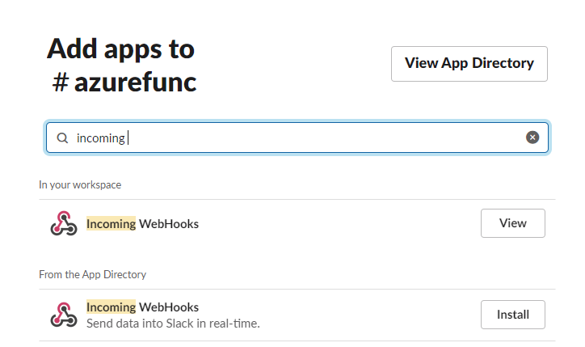
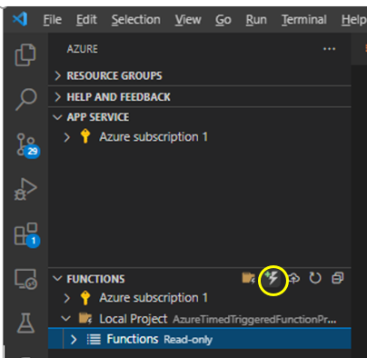

# Azure Functions Timer Triggered Project

Hello!!!🥳

## About Azure Functions Timer Triggered Project! 📣

In the developer community, let us say for example "Stack Overflow", you may have seen that many customers post their queries/ issues. Now, lets us say that you as a developer who contributes regularly to the Stack overflow developer community by answering to customer queries wants to be notified of the new questions that are posted on Stack overflow without having to manually go and check how many questions have been posted today based on a particular criteria like "Azure". You want to get notified on the total number of new questions that are posted in Stack overflow in the past 24 hours so that you can proactively respond to the questions and obtain positive customer feedback.

In this project, I have created Azure Time Triggered function that will run every 5 minutes (TimeTriggered). Once the function is triggered, it will search Stack Overflow for a certain topic (based on your search), query the questions repository using its API and then message will be sent to the Slack Channel with the number of new questions that are available on Stack Overflow. This is then notified via email. 

## 💯 Short Introduction On Azure Functions 💯
Azure Functions is Serverless meaning you don't really have to worry about the infrastructure to run these functions. You just need to focus on the code using the langusge of your choice and Azure will manage your infrastructure. These services can trigger your function or send data input to your function or receive data output from your function. 
Serverless Logic - Code you write runs on servers that azure manages. 

Azure Functions are activated by triggers. The Triggers include:
1. HTTPTrigger -  Azure Function code executes when it receives a HTTP request
2. TimerTrigger – Azure Function code executes on a schedule, ideal for batch or clean-up tasks.
3. EventHubTrigger – Azure Function code executes in response to events delivered by an Azure Event Hub

### Pre-requisites for this Project 💡
- Slack Account (Free Account Available)
- Microsoft Azure Account (Free Account)
- Azure Functions
- Azure Functions Core Tools
- .Net Core 3.1
- Visual Studio Code 2019

### Lets Get Started!!! 💻

 I first created a slack account. Navigate to slack.com and sign up for a free account. Once your have logged in, click on "Create a Channel".

I have created my channel called azurefunc. In the next step, if you wish you can add more people in your team or else click on "Skip for Now". 

Here, I will make use to Slack API and Slack Webhook in order to send messages 📩 

I then added an app called incoming webhooks to my slack, added Incoming Webhooks Integration to my channel "azurefunc" which inturn provided a web URL. Be sure to copy this URL on a notepad before you proceed to save settings as this URL will be referenced in your code. 

In order to check whether if I am able to receive any incoming messages on my slack channel, I then used Postman to test my slack-end point. Postman is one of the best tools for API testing and I highly recommend that you try it out.  

On Postman, I selected my HTTP function to be POST and pasted the weburl that we had copied earlier. In the body of my message, I entered{"text":"My name is Nitin"} and then clicked on Send. I then got a HTTP 200 Ok message. Ideally, I should now see the message "my name is Nitin" on my slack. 

Go to your slack channel and you should see the message from incoming-webhook "My name is Nitin".💯

### Here is the part where Coding begins!!!🔧

We need to define 2 method functions which are asynchronous in our code, where one of them will make a call to slack with a message and the other function is going to make a call to StackOverflow and get a number of questions. 

You will need to launch Visual Studio Code here! 📌

Under Azure Extensions, I first created a New Project in Visual Studio Code 

- Under Azure Functions Extension, select the option "Create New Project" and named it "AzureTimedTriggeredFunctionProject"
- Select you language to be C#
- Select your run time to be .NET Core 3 LTS
- Select your template to be Timer Triggered
- Name your Timer Trigger function name, in my case I named it AzureProjectTimedTrigger
- Provide a namespace, in my case I names it AzureProjectTimedTrigger.Function
- Enter the cron expression for your timer, since I want the trigger to be scheduled at 9:30 everyday, my cron expression would be "0 30 9***", default value is "0 */5 * * * *" (every 5 minutes)
- You will then be prompted to Select Storage account, create new storage account, in my case I named it AzureProjectTimedTrigger
- I then created a new resource group, I named it as AzureProjectTimedTrigger
- Select the location of your resource group, in my case I selected East US 2 for my location

I then created a function under Azure Extension Functions

- Select the template to be "Time Triggered"
- Provide your function name  - I named it as "AzureProjectTimedTrigger"
- Provide a namespace  - I named my namespace to be "AzureProjectTimedTrigger.Function"
- Default crontab expression for timer - 0 */5 * * * *
#### Method Function 1 ✏️
I created a new asynchronous function MakeSlackRequest. MakeSlackRequest will take 1 string parameter: the message we want to send to Slack. “HttpClient” object was used to make a POST request to our Slack endpoint. 

Please find below the code. 👇
 
using System;
using System.Text;
using System.Threading.Tasks;
using System.Net.Http;
using Microsoft.Azure.WebJobs;
using Microsoft.Azure.WebJobs.Host;
using Microsoft.Extensions.Logging;

namespace AzureProjecTimedTrigger.Function
{
    public static class AzureProjectTimedTrigger
    {
        [FunctionName("AzureProjTimedTrigger.Function")]
        public static async Task Run([TimerTrigger("0 */5 * * * *")]TimerInfo myTimer, ILogger log)
        {
            await MakeSlackRequest("Testing using Azure!");

            log.LogInformation($"C# Timer trigger function executed at: {DateTime.Now}");
        }
        public static async Task<string> MakeSlackRequest(string message)
        {
            using (var client = new HttpClient())
            {
                var requestData = new StringContent("{'text':'" + message + "'}", Encoding.UTF8, "application/json");

                var response = await client.PostAsync($"<Enter your SLACK WebURL here>", requestData);

                var result = await response.Content.ReadAsStringAsync();

                return result;             
            }
        }
    }
}

After running the above function locally, I was then able to see the message "Testing using Azure!" on my slack channel. This confirmed that I was able to make a call to the web hook with a static message. 👌

Now, the next part of the function is to define what is being consumed. For this, I visited StackOverflow API also known as [Stack Exchange API guide](https://api.stackexchange.com/docs). Since, I just want to do a simple search, I visited [StackExchange - Usage of Search API](https://api.stackexchange.com/docs/search).

As seen in the screenshot above, if I need to know if any new questions were posted in the past 24 hours around topic "azure", then I will need to include the word "azure" in the box next to "intitle" and select previous day date next to "fromdate". Now, click on Run to get the response JSON. 

Before you move ahead, please be sure to copy the API request URL which in my case it is  https://api.stackexchange.com/2.3/search?fromdate=1635206400&order=desc&sort=activity&intitle=azure&site=stackoverflow

### Let's continue coding our function. 🔧

#### Method Function 2 ✏️

Here is my code for StackOverflow. 👇

We will need to add 2 new "using derivatives"
using System.Net;
using Newtonsoft.Json;

Top of our function should be similar to what is seen below:

using System;
using System.Text;
using System.Net;
using Newtonsoft.Json;
using System.Threading.Tasks;
using System.Net.Http;
using Microsoft.Azure.WebJobs;
using Microsoft.Azure.WebJobs.Host;
using Microsoft.Extensions.Logging;

The next step is to add a new method before our MakeSlackRequest method.

Few things to note here is that we have used "GetAsync" on the HttpClient object instead of using PostAsync. 

Also, one important thing to keep in mind is that when you create a HttpClientHandlerobject which is used to setup our HttpClient object, we would then want to decompress the results from our API call. Normally StackOverFlow returns its json payload compressed in zip format.

Code below:

    public static async Task<string> MakeStackOverflowRequest()
        {
            HttpClientHandler handler = new HttpClientHandler()
            {
                AutomaticDecompression = DecompressionMethods.GZip | DecompressionMethods.Deflate
            };

            using (var client = new HttpClient(handler))
            {
                var response = await client.GetAsync($"https://api.stackexchange.com/2.3/search?fromdate=1635206400&order=desc&sort=activity&intitle=azure&site=stackoverflow");

                var result = await response.Content.ReadAsStringAsync();

                return result;
            }
        }

Now that we have a method defined to our code to consume StackOverFlow Request, we now need to obtain the new question count for the questions posted on StackOverFlow for keyword search "azure" and in order to fo that we need to to decompress the lines of the json string for which we get a return back. 

Lets add the method to obtain the count befour our MakeStackOverflowRequest.

public static async Task Run([TimerTrigger("0 */5 * * * *")]TimerInfo myTimer, ILogger log)
        {
            var jsonString = await MakeStackOverflowRequest();

            var jsonOb = JsonConvert.DeserializeObject<dynamic>(jsonString);

            var newQuestionCount = jsonOb.items.Count;

            await MakeSlackRequest($"You have {newQuestionCount} question on Stack Overflow!");

            log.LogInformation($"C# Timer trigger function executed at: {DateTime.Now}");
        }

After running my azure function locally, I was then able to get the question count on my slack channel. ✌️

Now, that the Azure function is working well locally, it is now time to deploy this function to Azure Function App. 
In Visual Studio Code, under Azure Extensions, navigate to the project where your function was created. 

Select the option "Deploy to Function App"
- Created a new Function App named AzureProjectTimedTrigger
- Runtime stack was selected to be .NET Core 3.1
- Location was selected as East US 2

This function was then created in a new storage account “azureprojecttimedtrigger”

The Azure Function App was deployed successfully and I was able to see the incoming web-hook response from Stack Overflow on my slack channel with the number of questions for keyword "azure".

On Microsoft Azure Portal,  I was able to see the Memory working set metric for "Azure Timer Tiggered Function App. ✅

## Optional Steps in case if you want to run the function everyday as opposed to running every 5 minutes. 🏁

What we can do here is to dynamically create that UTC time string so when the function runs every hour or everyday, that will be dynamically be generated. One more thing we need to do is to update our schedule which will set this function to run everyday as opposed to running every 5 minutes. 

Unix Titan string that has got a hard coded value in there, we want to set that dynamically so that we just pull back questions within last 24 hours rather than having something hard-coded. It is best to put this under StackOverFlow Request Method. 

Code shoudl look like this:
var epochTime = (Int32)(DateTime.UtcNow.AddDays(-1).Subtract(new DateTime(1970,1, 1))).TotalSeconds;

Since date time no object is being used, we are getting the Universal Time Now as of this moment but we want to get questions within the last 24 hours, so in in order to update that we use AddDays and Operator (we add -ve days), we can add -ve numbers to subtract these from where we are now. So if we want questions within 24 hours, then it would be -1 and then we want to effectively Subtract from now this unix epoch type (new DateTime(1970,1, 1))).TotalSeconds and get Total seconds of that subtraction and that gives us the time span for now. The last thing you want to do is to convert to a 32 bit integer (int 32) which is the standard we need to use. 

In order for the schedule of this function to run everyday day and not every 5 mins, navigate to function.json file, update the crontab expression to “0 30 9 * * *”, which would run at 9:30 everyday

So now, we go ahead and delete the hardcoded value, copy and paste epochTime in the curly brackets of response URL which should then dynamically update moving forward. 

 var response = await client.GetAsync($"https://api.stackexchange.com/2.3/search?fromdate={epochTime}&order=desc&sort=activity&intitle=azure&site=stackoverflow");

Few Important Resources:

- [Azure Functions Timer trigger](https://docs.microsoft.com/en-us/azure/azure-functions/functions-bindings-timer?tabs=csharp)
- [Create a C# function in Azure using Visual Studio Code](https://docs.microsoft.com/en-us/azure/azure-functions/create-first-function-vs-code-csharp)
- [Manage your Function App](https://docs.microsoft.com/en-us/azure/azure-functions/functions-how-to-use-azure-function-app-settings?tabs=portal#cors)

Cheers!

Nitin Jagwani 🤙
